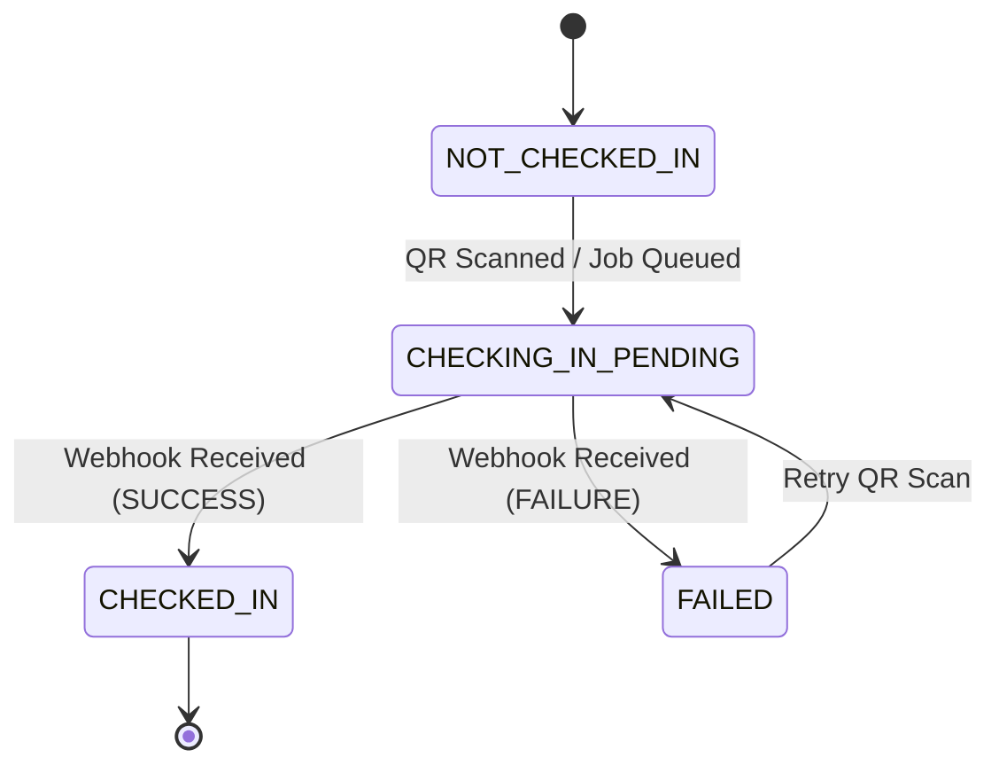
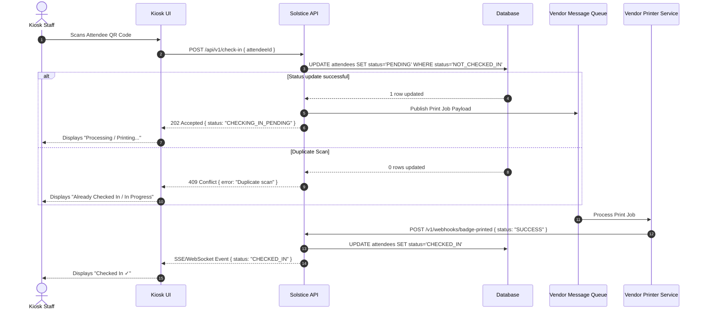

# Solstice Events Co. – Asynchronous Kiosk Check-In Solution

## 1. Executive Summary
Solstice Events Co. is transitioning its event check-in kiosk system from a synchronous REST API model to an asynchronous event-driven architecture. Due to the badge-printer vendor deprecating their synchronous API, check-in requests are now pushed to a vendor message queue, and status updates are received via an inbound webhook callback. This design prevents duplicate badge printing and manages UI states during async processing.

---

## 2. Attendee State Machine

To support asynchronous processing, attendee records transition through four explicit states:

* **`NOT_CHECKED_IN`**: Initial state before badge scanning.
* **`CHECKING_IN_PENDING`**: Set immediately upon scanning to lock the record and prevent duplicate processing.
* **`CHECKED_IN`**: Updated when a successful webhook callback is received.
* **`FAILED`**: Set if printing fails, allowing staff to re-scan.



---

## 3. End-to-End System Sequence



---

## 4. API & Data Contracts

### Outbound Queue Payload (To Vendor Queue)
```json
{
  "print_job_id": "job_9f82a10b",
  "attendee_id": "att_40219",
  "badge_template": "standard_attendee",
  "callback_url": "[https://api.solstice.com/v1/webhooks/badge-printed](https://api.solstice.com/v1/webhooks/badge-printed)"
}
```

### Inbound Webhook Payload (From Vendor Printer)
```json
{
  "print_job_id": "job_9f82a10b",
  "attendee_id": "att_40219",
  "status": "SUCCESS",
  "completed_at": "2026-08-21T10:28:00Z"
}
```

---

## 5. Concurrency & Duplicate-Scan Guardrails

Duplicate scans are blocked at the database level using atomic conditional updates:

```sql
UPDATE attendees 
SET status = 'CHECKING_IN_PENDING', print_job_id = 'job_9f82a10b'
WHERE attendee_id = 'att_40219' 
  AND status IN ('NOT_CHECKED_IN', 'FAILED');
```

If an attendee is scanned while already `CHECKING_IN_PENDING` or `CHECKED_IN`, the database modifies 0 rows, and the API returns HTTP `409 Conflict` to prevent a second print job.

---

## 6. Test Matrix & Validation Results

| Test Case | Scenario | Expected System Behavior | Status |
| :--- | :--- | :--- | :--- |
| **Attendee 1** | Standard Scan | Status updates to `PENDING` $\rightarrow$ Webhook confirms `CHECKED_IN`. | **PASS** |
| **Attendee 2** | Standard Scan | Status updates to `PENDING` $\rightarrow$ Webhook confirms `CHECKED_IN`. | **PASS** |
| **Attendee 3 (Scan 1)** | Initial Scan | Status updates to `PENDING` $\rightarrow$ Queue job issued. | **PASS** |
| **Attendee 3 (Scan 2)** | Rapid Duplicate Scan | Request rejected (HTTP 409); no secondary print job queued. | **PASS** |
| **Edge Case** | Out-of-Order Webhook | Webhook checks `status = 'PENDING'`; duplicate webhooks ignored safely. | **PASS** |
